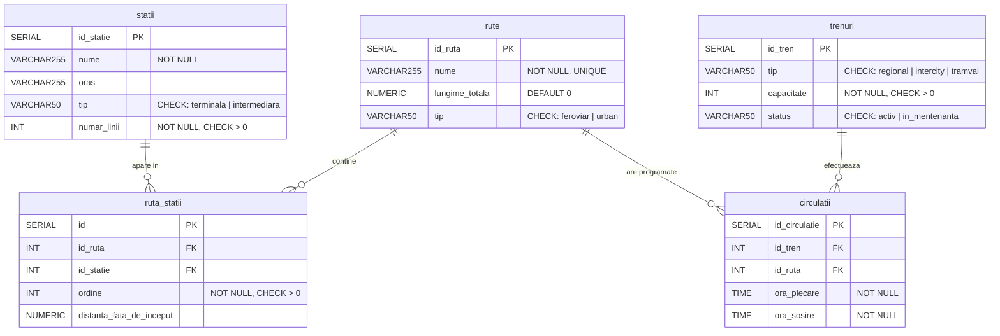

# Diagrama ER — Sistem Management Feroviar

Diagrama entitate-relație a bazei de date PostgreSQL (Supabase) pentru sistemul de management feroviar.
Conține 5 tabele, relațiile dintre ele (1-N și N-M), cheile primare, cheile străine și constrângerile principale.

## Relatii

| Relatie | Tip | Descriere |
|---|---|---|
| `rute` → `ruta_statii` | 1-N | O rută are mai multe intrări în tabelul de legătură |
| `statii` → `ruta_statii` | 1-N | O stație apare în mai multe rute |
| `rute` ↔ `statii` prin `ruta_statii` | **N-M** | Relație many-to-many cu atribute: `ordine`, `distanta_fata_de_inceput` |
| `trenuri` → `circulatii` | 1-N | Un tren poate avea mai multe circulații |
| `rute` → `circulatii` | 1-N | O rută poate avea mai multe circulații |

## Constrângeri cheie

| Tabel | Constrângere |
|---|---|
| `statii` | `numar_linii > 0`, `tip IN ('terminala','intermediara')` |
| `trenuri` | `capacitate > 0`, `tip IN ('regional','intercity','tramvai')`, `status IN ('activ','in_mentenanta')` |
| `rute` | `UNIQUE(nume)`, `tip IN ('feroviar','urban')` |
| `ruta_statii` | `ordine > 0`, `UNIQUE(id_ruta, ordine)`, `UNIQUE(id_ruta, id_statie)` |
| `ruta_statii` | FK `id_ruta` → `rute` ON DELETE CASCADE |
| `ruta_statii` | FK `id_statie` → `statii` ON DELETE RESTRICT |
| `circulatii` | FK `id_tren` → `trenuri` ON DELETE RESTRICT |
| `circulatii` | FK `id_ruta` → `rute` ON DELETE RESTRICT |
